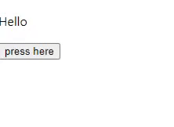

# renotify-react

> A react notification library

[](https://www.npmjs.com/package/renotify-react) [](https://standardjs.com)

## Install

```bash
npm install --save renotify-react
```

## Usage

Make sure to import the default export and add it to the root of your
react components.
```jsx
import React, { Component } from 'react'

import Renotify from 'renotify-react'
import 'renotify/dist/index.css'

class Example extends Component {
  render() {
    return (
    <div>
    {/*Other components*/}
    <Renotify />
    </div>
)
  }
}
```


Then you can import the notify object anywhere in your app
 and in any component to use it
```jsx
import {notify} from 'renotify-react'

function Example(){

  const notification = ()=>{
    notify.show({
          title: "Kofi is online!",
          subTitle: "Want to chat with him?",
          type: "success",
          style: {
                //css in js style
            },
          confirm: true,
          confirmText: "Yes",
          cancelText: "No",
          confirmAction: function(){
              //What to do when user clicks ok
          }
    })
  }
  return(
  <div>
  {/*  Normal codes*/}
  </div>
)
}
```

## Example



## License

MIT © [Augani](https://github.com/Augani)
